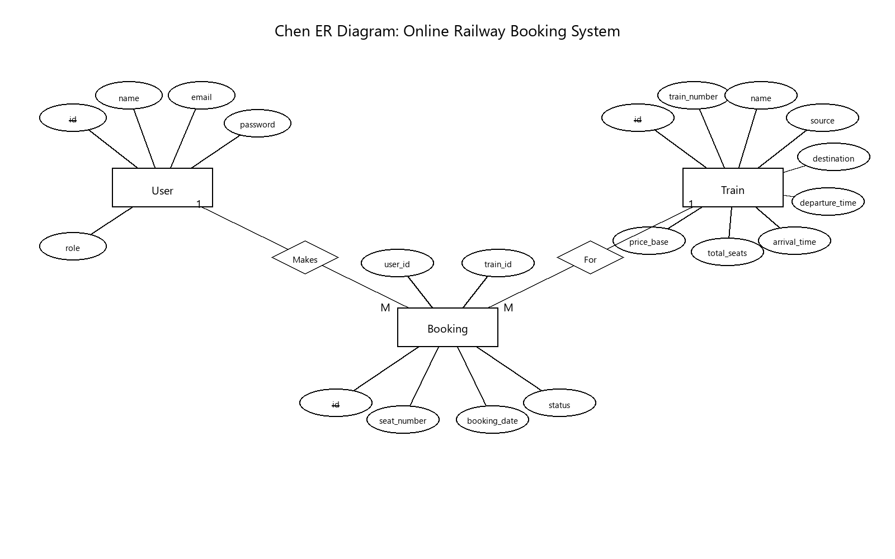
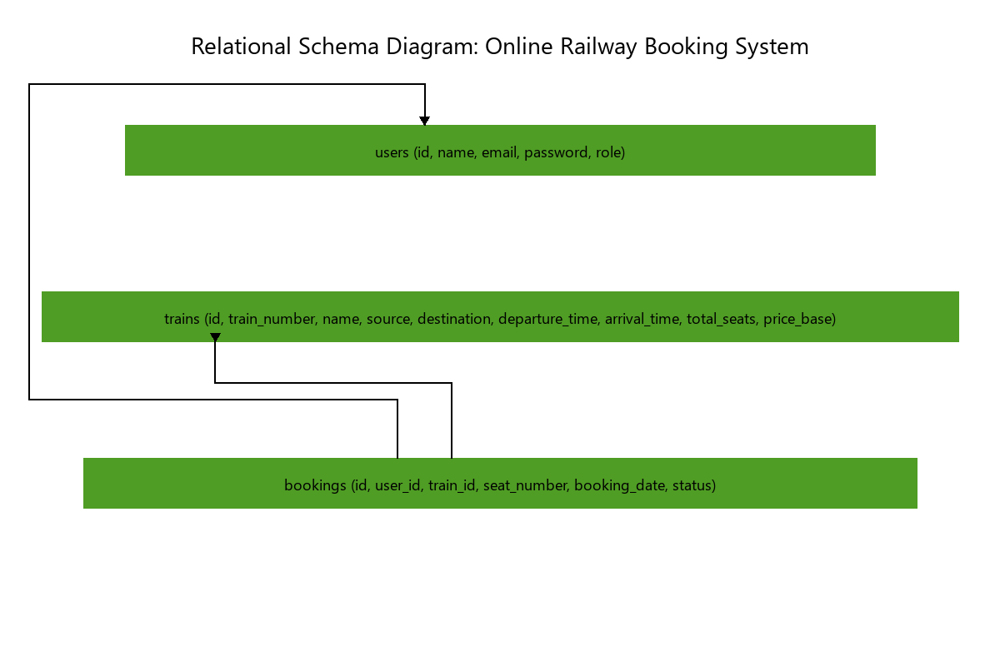

# Elite Rail - Premium Railway Booking Portal (DBMS Mini Project)

Elite Rail is a full-stack premium railway booking application featuring a glassmorphic UI, robust SQLite database, and seamless user experience. Designed for elegance and reliability.

## 🚀 Quick Start

1. **Install Dependencies** (Root, Client, and Server):
   ```bash
   npm install
   cd frontend && npm install
   cd ../backend && npm install
   ```

2. **Run the Application**:
   - **Option A (Easy)**: Double-click `start_app.bat` in the root folder.
   - **Option B (Manual)**: Run `npm run dev` in the terminal.

   - **Frontend**: http://localhost:5173
   - **Backend**: http://localhost:5000

## 🛠️ Technology Stack

- **Frontend**: React.js, Vite, Framer Motion (Animations), Lucide React (Icons), Vanilla CSS (Custom Design System).
- **Backend**: Node.js, Express.js.
- **Database**: SQLite3 (Local file-based RDBMS).
- **Styling**: Modern Corporate with Glassmorphism.

## 📊 Database Schema (DBMS Specs)

The project uses a Relational Database Management System (RDBMS) with the following tables:

- `users`: Manages passenger credentials, emails, and roles (user/admin).
- `trains`: Stores train details, route locations (Source/Destination), timings, and seat availability.
- `bookings`: Tracks digital ticket bookings, passenger user IDs, assigned seats, and booking statuses.

* **Schema SQL File**: `backend/schema.sql`
* **Database File**: `backend/railway.db` (Generated automatically on first run)

### 📐 Entity-Relationship (ER) Diagram
This classic **Chen-style ER Diagram** illustrates the database entities (`User`, `Train`, `Booking`), their attributes (with primary keys underlined), and their structural relationships (`Makes`, `For`) along with their respective cardinallity constraints (`1` to `M`).



### 📋 Relational Schema Diagram
This **Relational Schema Diagram** maps the relational tables, attributes, and referential integrity (foreign key) constraints. Arrows connect the referencing foreign keys (`bookings.user_id` and `bookings.train_id`) directly to their parent primary keys (`users.id` and `trains.id`).



## ✨ Premium Features

- **Glassmorphic UI**: Translucent surfaces with backdrop blurs and high-end typography.
- **Dynamic Search**: Real-time filtering of trains based on source and destination.
- **Seat Selection**: Interactive seat layout with price calculation.
- **My Journeys**: Digital ticket dashboard for managing personal bookings.
- **Responsive Design**: Optimized for both Desktop and Mobile views.

## 📁 Project Structure

```text
Elite Rail/
├── assets/              # Visual diagrams and application screenshots
├── backend/             # Node.js + Express.js API Server
│   ├── database.js      # SQLite3 connection & table setup
│   ├── index.js         # API endpoint routes & logic
│   └── schema.sql       # Database schema creation & seeding
├── documents/           # Project reports, presentations, and DBMS specs
│   ├── DBMS RRR.4.pptx
│   ├── DBMS project report format.docx
│   └── EliteRail_DBMS_Report.pptx
├── frontend/            # React + Vite Client Application
│   ├── src/
│   │   ├── api/         # Axios API backend client
│   │   ├── components/  # Reusable UI component modules
│   │   ├── pages/       # User & admin page screens
│   │   └── index.css    # Custom premium CSS design system
│   └── package.json
├── package.json         # Root package file for multi-service execution
└── start_app.bat        # Windows root script launcher
```

---
*Developed for Elite Rail - Excellence in Motion.*
