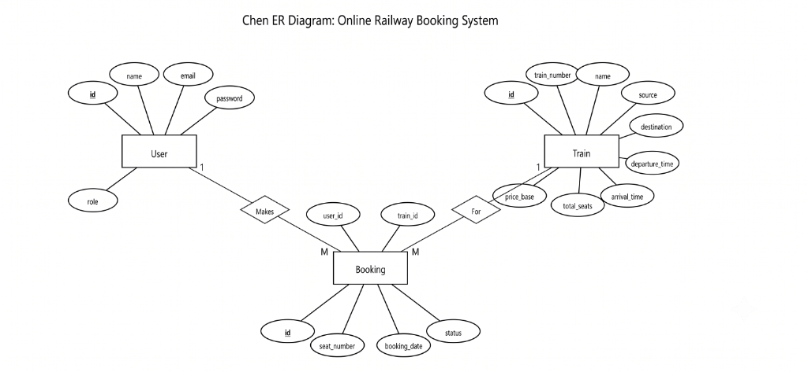
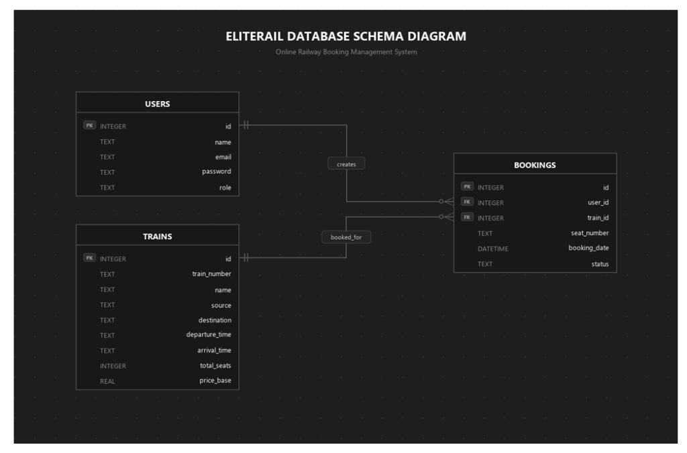
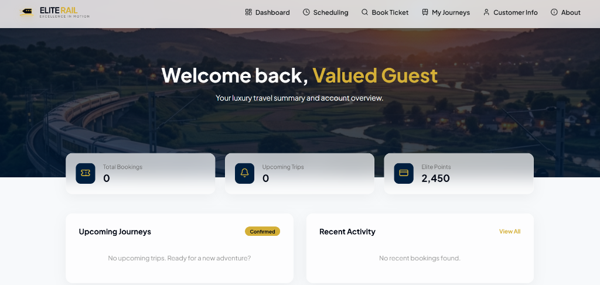
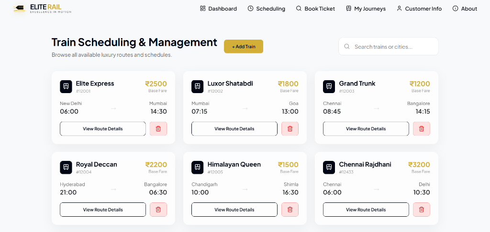
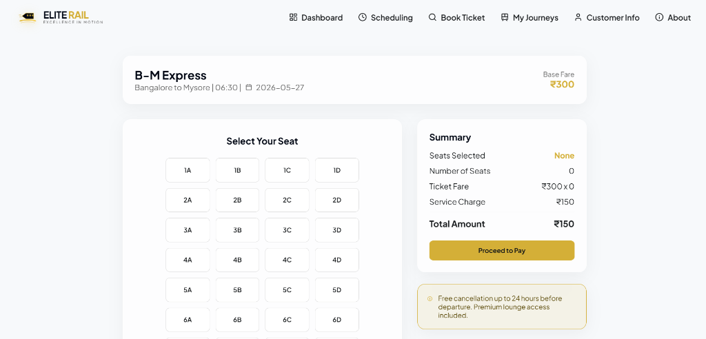
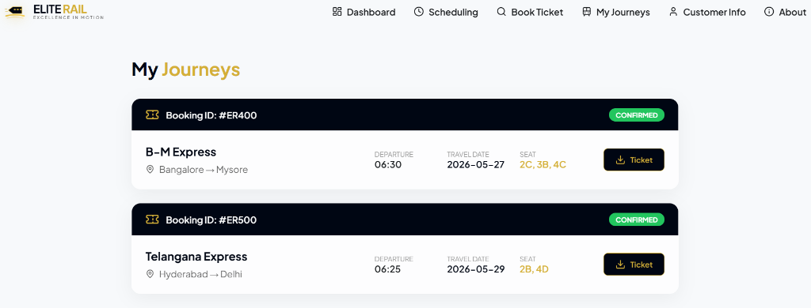

# Elite Rail - Premium Railway Booking Portal (DBMS Mini Project)

Elite Rail is a full-stack premium railway booking application featuring a glassmorphic UI, robust SQLite database, and seamless user experience. Designed for elegance and reliability.

## 🚀 Quick Start

1. **Install Dependencies** (Root, Client, and Server):
   ```bash
   npm install
   cd frontend && npm install
   cd ../backend && npm install
   ```

2. **Run the Application**:
   Run `npm run dev` in the terminal.

   - **Frontend**: http://localhost:5173
   - **Backend**: http://localhost:5000

## 🛠️ Technology Stack

- **Frontend**: React.js, Vite, Framer Motion (Animations), Lucide React (Icons), Vanilla CSS (Custom Design System).
- **Backend**: Node.js, Express.js.
- **Database**: SQLite3 (Local file-based RDBMS).
- **Styling**: Modern Corporate with Glassmorphism.

## 📊 Database Schema (DBMS Specs)

The project uses a Relational Database Management System (RDBMS) with the following tables:

- `users`: Manages passenger credentials, emails, and roles (user/admin).
- `trains`: Stores train details, route locations (Source/Destination), timings, and seat availability.
- `bookings`: Tracks digital ticket bookings, passenger user IDs, assigned seats, and booking statuses.

* **Schema SQL File**: `backend/schema.sql`
* **Database File**: `backend/railway.db` (Generated automatically on first run)

### 📐 Entity-Relationship (ER) Diagram
This classic **Chen-style ER Diagram** illustrates the database entities (`User`, `Train`, `Booking`), their attributes (with primary keys underlined), and their structural relationships (`Makes`, `For`) along with their respective cardinallity constraints (`1` to `M`).



### 📋 Star Schema Diagram
This **Star Schema Diagram** (fact-and-dimension design) showcases the database tables and key constraints inside a premium dark-mode canvas, illustrating the relationships between the central fact table (`bookings`) and its dimension tables (`users` and `trains`) using standard crow's foot notation. Lines link the foreign keys directly to their referenced keys.



## 📸 Application Screenshots

### 📊 Passenger Dashboard
A glassmorphic, personalized travel dashboard displaying a premium welcome banner, quick trip statistics, upcoming journeys, and recent activity.


### 🗺️ Train Scheduling & Management
An intuitive schedule management screen listing premium train offerings, real-time ticket pricing, dynamic search capabilities, and admin controls.


### 💺 Interactive Seat Selection
An engaging ticket booking interface featuring a live, selectable seat map, instant ticket pricing, dynamic service charges, and automatic grand total calculations.


### 🎫 My Journeys Dashboard
A clean, visual ticket locker allowing passengers to view, print, or download confirmed luxury e-tickets for their upcoming travels.



## ✨ Premium Features

- **Glassmorphic UI**: Translucent surfaces with backdrop blurs and high-end typography.
- **Dynamic Search**: Real-time filtering of trains based on source and destination.
- **Seat Selection**: Interactive seat layout with price calculation.
- **My Journeys**: Digital ticket dashboard for managing personal bookings.
- **Responsive Design**: Optimized for both Desktop and Mobile views.

## 📁 Project Structure

```text
Elite Rail/
├── backend/             # Node.js + Express.js API Server
│   ├── database.js      # SQLite3 connection & table setup
│   ├── index.js         # API endpoint routes & logic
│   └── schema.sql       # Database schema creation & seeding
├── frontend/            # React + Vite Client Application
│   ├── src/
│   │   ├── api/         # Axios API backend client
│   │   ├── components/  # Reusable UI component modules
│   │   ├── pages/       # User & admin page screens
│   │   └── index.css    # Custom premium CSS design system
│   └── package.json
├── .gitignore           # Git ignore settings (local-only assets & documents excluded)
├── interfaces/          # User interface assets and database diagrams
│   ├── booking.png      # Interactive seat selection screenshot
│   ├── dashboard.png    # Valued guest travel summary dashboard screenshot
│   ├── er_diagram_v2.png # Chen ER diagram image (GitHub active)
│   ├── favicon.svg      # Page tab favicon icon
│   ├── hero-bg.png      # Home section hero banner background
│   ├── journeys.png     # Digital ticket dashboard screenshot
│   ├── schema_diagram.png # Star Schema diagram image (GitHub active)
│   └── scheduling.png   # Train scheduling & management screenshot
├── package.json         # Root package file for multi-service execution
└── requirements.txt     # Summary list of project prerequisites
```

---
*Developed for Elite Rail - Excellence in Motion.*

